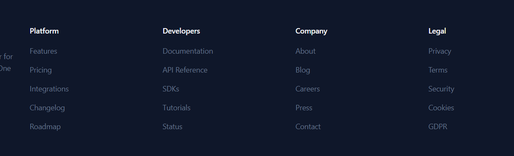

first need of Mine will be-> 
setting--> {
-ApiKeys 
-callbackUrl 
--security_Summary }

-> come webhhok navbar part {
Total-> Count per Day 
-> succeded Kitne Huye 
-> Failed 
-> Total Attempty (Point of View to Stand this Feature inside the webhook Delivery)
-> Refresh Point why needed What will Effecient Logic For This one and Auto Refresh After 60 minutes (Cron Job);
->  Today Webhhokk Delivery-> Date Specifc History Bar 
-> With Csv Export -> konsi Date

}
Transction Navbar Part 
{
Refresh would be Of 5 min Refresh 
Listing of Today Transction Only 
date wise Listing by default Present date Will be show trnaction basis 
{export csv Will Export same type  as the webhook Part only data will be here of the transction}
}

Docs NavBar 
{
    All Kind of Information before and event after the login 
}

Setting would be Hide before login and sinup 

Search transction Would be Messy for now as lot of payment are done But Not needed 

For public there will be No Login and sinup page only teh Current pages without login and sinup ok And a Form side to Contact Not for now 

and also React Modal for payment doing and also the order id will be shared form the backend as click on the pay button then after custom modal will be open and then the payment defatiled would be there for the razerpay ok then rest will same 

Not Now Next Work 
how will i manage the creditonal or dashbaorfd of the Two Diffrent apps in a single dashbaoard without conflict and merging. 
i will made a resuable  things where just login then enough will be there screen

from this file we can see then i need only neecssaye things in the header part only nothing more then that Not Company Legal 
only docs api refrence integration
features 
only that it's for the internal system not for the public one ok this our Product now which we will intergate into the system 
and also this page will be sperate sidebar in which a single page is there like documentation -> side bar api refer document only 
Ohk 